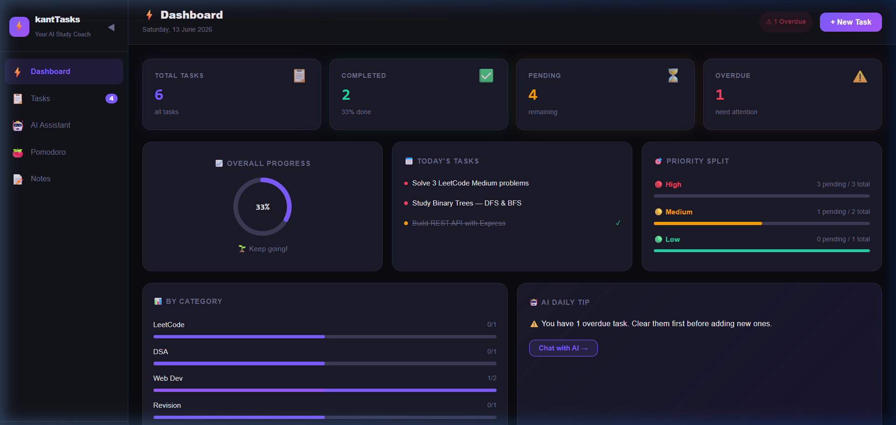

# ⚡ kantTasks — AI Study Coach & Personal Assistant

`kantTasks` is a premium, fully-responsive task manager and study coach designed to boost your daily learning productivity. Combining a modern dark-mode interface, task analytics, an embedded Pomodoro timer, rich markdown notes, and a context-aware AI assistant, it acts as a centralized command center for your studies.

---

## 📸 Dashboard Preview



---

## ✨ Key Features

1. **📊 Interactive Analytics Dashboard**
   - **Real-Time Stats**: Quick overview of Total, Completed, Pending, and Overdue tasks.
   - **Overall Progress Ring**: Beautiful animated circular progress indicator.
   - **Priority Distribution**: Track your split between High, Medium, and Low priority tasks.
   - **Mini Bar Chart**: Break down tasks by categories (*LeetCode, DSA, Web Dev, Revision, Projects, etc.*).

2. **📋 Task Manager**
   - Standard CRUD operations (Create, Read, Update, Delete) for tasks.
   - Powerful filters (Filter by Status, Category, Priority) and real-time search.
   - Intelligent due-date tags (e.g., Today, Overdue, Future).

3. **🤖 Context-Aware AI Study Coach**
   - Ask the AI Assistant about your workload: *"What should I focus on first?"*, *"How productive am I today?"*, or *"Show me my pending work"*.
   - Generates personalized study tips, sliding window schedules, and DSA preparation strategies.

4. **🍅 Animated Pomodoro Timer**
   - Standard 25-minute study / 5-minute break cycles.
   - Animated SVG circle counting down in real-time.
   - Track completed Pomodoro cycles to gamify your focus sessions.

5. **📝 Rich Notes View**
   - Jot down roadmap concepts, sliding window templates, or general ideas.
   - Fully optimized **Master-Detail view** for mobile devices (includes back-navigation, full-screen editor support).

6. **📱 Fully Responsive Design**
   - Fully fluid for large monitors and desktops.
   - Dynamically collapses into an overlay drawer with an overlay backdrop on mobile screens.
   - Grids collapse to single-columns seamlessly on phone widths.

---

## 🛠 Tech Stack

- **Core**: React 19 + Vite 8
- **Bundler**: Rolldown (Rust-based)
- **Styling**: Pure CSS + inline-styles & keyframe animations
- **Icons**: Fluent emojis

---

## 🚀 Getting Started

### Prerequisites

Make sure you have Node.js (`v20` or higher recommended) and npm installed on your machine.

### Installation

1. Clone or copy this project to your local directory.
2. Navigate to the project root:
   ```bash
   cd Personal-assistant/my-app
   ```
3. Install dependencies (specifically resolves native binding dependencies for Rolldown under Windows):
   ```bash
   npm install
   ```

### Running the App

Start the development server:
```bash
npm run dev
```

Open [http://localhost:5173](http://localhost:5173) in your browser to view the application.
